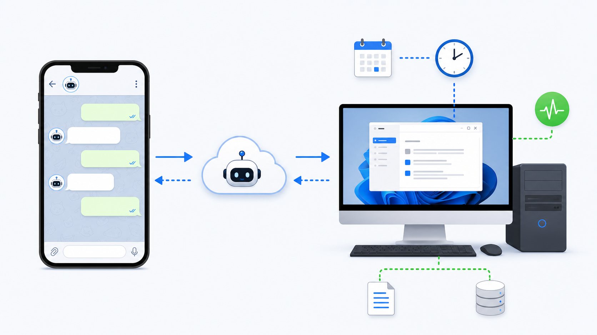
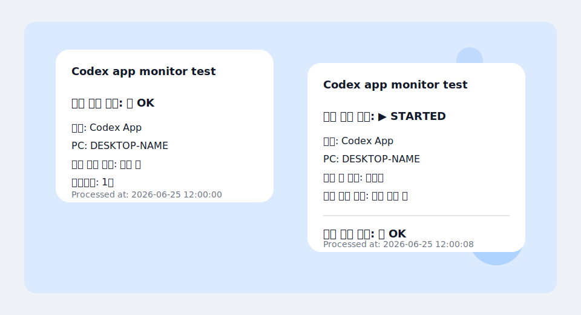

# Codex App Telegram Monitor

전용 Telegram 봇으로 Windows용 Codex 데스크톱 앱의 상태 점검, 알림, 원격 실행을 관리하는 PowerShell 도구입니다.



## 처음 사용하는 권장 순서

1. Telegram에서 `@BotFather`로 전용 봇을 만들고 bot token을 복사합니다.
2. Windows PC에서 이 저장소를 clone합니다.
3. 통합 설치 스크립트 `install_all.ps1`을 실행합니다.
4. PowerShell 안내에 따라 bot token을 입력합니다.
5. Telegram에서 새 bot에게 `/start`를 보냅니다.
6. PowerShell로 돌아와 Enter를 누릅니다.
7. 설치가 끝나면 Telegram에서 `/p`, `/s`, `/o`를 순서대로 테스트합니다.

```powershell
git clone https://github.com/okorion/codex-app-telegram-monitor.git
cd codex-app-telegram-monitor
powershell.exe -NoProfile -ExecutionPolicy Bypass -File .\install_all.ps1
```

`install_all.ps1`은 `.env` 설정, `.env` ACL 보호, Telegram 명령 메뉴 등록, 테스트 메시지 전송, 09:00 daily monitor 설치, command listener 설치, watchdog 설치, health check를 한 번에 처리합니다.

## Codex App 제어 조건

설치 후 아래 조건이 맞으면 휴대폰 Telegram에서 Codex App을 제어할 수 있습니다.

- PC가 켜져 있어야 합니다.
- Windows 사용자가 로그인되어 있어야 합니다.
- PC가 절전 상태가 아니어야 합니다.
- PC에서 Telegram API로 나가는 인터넷 연결이 가능해야 합니다.
- `Codex Telegram Command Listener` 예약 작업이 실행 중이어야 합니다.
- 명령을 보내는 Telegram 채팅이 `.env`의 허용 chat ID 목록에 포함되어야 합니다.
- Codex 데스크톱 앱이 해당 PC에 설치되어 있어야 합니다.

이 도구는 Telegram long polling을 사용합니다. 외부에서 PC로 들어오는 포트나 webhook 서버는 필요하지 않습니다. 다만 PC가 꺼져 있거나, 절전 상태이거나, 사용자가 로그인되어 있지 않으면 GUI 앱인 Codex App을 시작할 수 없습니다.

## Telegram 명령어

허용된 bot 채팅에 아래 명령을 보냅니다.

| 짧은 명령 | 전체 명령 | 용도 |
| --- | --- | --- |
| `/p` | `/ping` | command listener가 응답 중인지 빠르게 확인합니다. |
| `/s` | `/codex_status` | Codex App이 현재 실행 중인지 확인합니다. |
| `/o` | `/codex_on` | Codex App을 원격 실행합니다. 요청 메시지를 먼저 보내고, 이후 최종 `OK` 또는 `WARN` 결과를 보냅니다. |
| `/h` | `/codex_health` | Telegram, 예약 작업, listener, heartbeat, 로그, `.env` ACL 상태를 확인합니다. |
| `/v` | `/codex_version` | Codex App 감지 정보, package version, process path를 표시합니다. |
| `/l` | `/codex_logs` | 최근 listener 로그를 표시합니다. 기본값은 20줄입니다. |
| `/l 30` | `/codex_logs 30` | 지정한 줄 수만큼 최근 로그를 표시합니다. 허용 범위는 5-50줄입니다. |
| `/m` | `/help` | 사용 가능한 명령 목록을 표시합니다. |

개인 채팅에서는 자연어에 가까운 일부 메시지도 지원합니다. 예를 들어 `codex 상태`, `codex 실행`, `코덱스 앱 켜줘` 같은 메시지를 인식합니다. 그룹이나 supergroup에서는 일반 대화에 help가 나가지 않도록 `/` 명령 또는 bot mention이 있는 메시지에만 반응합니다. `/s@other_bot`처럼 다른 봇을 명시한 명령은 무시합니다.

## GUI 설정 도구

GUI는 필수 설치 경로가 아니라 보조 설정 도구입니다. 처음 설치할 때는 `install_all.ps1`의 콘솔 안내가 가장 쉽고, GUI는 기존 `.env`를 수정하거나 콘솔 입력이 불편할 때 유용합니다.

```powershell
powershell.exe -NoProfile -ExecutionPolicy Bypass -File .\configure-codex-telegram-gui.ps1
```

GUI에서 할 수 있는 일:

- `Telegram bot token` 입력
- 알림 chat ID, 명령 허용 chat ID, 실행 허용 chat ID 수정
- Telegram `getUpdates`로 최근 chat ID 감지
- GUI에서 Telegram 테스트 메시지 전송
- PC 표시 이름과 메시지 제목 수정
- `.env` 저장 및 ACL 보호
- 진단 스크립트 실행

주의: chat ID 감지는 bot에게 `/start` 또는 메시지를 보낸 뒤 실행해야 합니다. GUI는 감지 중 로컬 command listener를 잠시 중지하고 완료 후 다시 시작합니다. 그래도 다른 PC가 같은 bot token으로 polling 중이면 Telegram `409 Conflict`가 날 수 있으므로, 그 경우 다른 PC의 listener를 중지하거나 PC마다 별도 bot token을 사용하세요. GUI로 `.env`를 먼저 저장했다면 설치는 아래처럼 실행합니다.

```powershell
powershell.exe -NoProfile -ExecutionPolicy Bypass -File .\install_all.ps1 -SkipConfigure
```

## 주요 기능

| 영역 | 설명 |
| --- | --- |
| 09:00 자동 점검 | 매일 09:00에 Codex App 실행 여부를 확인합니다. 실행 중이 아니면 실행하고 결과를 Telegram으로 보냅니다. |
| 원격 실행 | 허용된 Telegram 채팅에서 `/o` 또는 `/codex_on`으로 Codex App을 실행합니다. |
| 상태 확인 | 실행 상태, 프로세스 수, 앱 버전, 예약 작업 상태, listener heartbeat, 최근 로그를 확인합니다. |
| 모바일 단축 명령 | `/o`, `/s`, `/h`, `/v`, `/l`, `/p`, `/m` 같은 한 글자 명령을 지원합니다. |
| Watchdog | 5분마다 command listener 예약 작업과 heartbeat를 확인하고, 멈췄거나 heartbeat가 오래되면 다시 시작합니다. |
| 로컬 보안 | 민감정보는 Git에서 제외된 `.env`에 저장하고, `.env` ACL 보호, 명령/실행 허용 채팅 분리, 로그 민감정보 redaction을 적용합니다. |
| 여러 PC 사용 | PC별 표시 이름을 지원하며, long polling 특성상 active PC마다 별도 bot token 사용을 권장합니다. |

## 동작 방식

```text
휴대폰 Telegram 채팅
  -> Telegram Bot API long polling
  -> Windows Task Scheduler listener
  -> Codex App 실행/상태/버전/로그 처리
  -> Telegram 결과 메시지
```

별도 예약 작업이 09:00 자동 점검과 listener watchdog을 담당합니다.

```text
09:00 daily task -> Codex App 확인 -> 필요 시 실행 -> Telegram 결과 전송
5 min watchdog  -> listener task/heartbeat 확인 -> 필요 시 listener task 재시작
```

## 요구 사항

- Windows 및 PowerShell 5.1 이상
- Codex 데스크톱 앱 설치
- `@BotFather`로 생성한 Telegram 봇
- 봇과의 개인 채팅

## 설치 옵션

통합 설치 중 일부 단계를 건너뛰어야 할 때는 아래 옵션을 사용할 수 있습니다.

```powershell
powershell.exe -NoProfile -ExecutionPolicy Bypass -File .\install_all.ps1 -SkipTelegramTest
powershell.exe -NoProfile -ExecutionPolicy Bypass -File .\install_all.ps1 -SkipDailyMonitor
powershell.exe -NoProfile -ExecutionPolicy Bypass -File .\install_all.ps1 -SkipCommandListener
powershell.exe -NoProfile -ExecutionPolicy Bypass -File .\install_all.ps1 -SkipEnvFileAcl
powershell.exe -NoProfile -ExecutionPolicy Bypass -File .\install_all.ps1 -SkipBotCommandMenu
```

수동으로 개별 단계를 실행할 수도 있습니다.

```powershell
powershell.exe -NoProfile -ExecutionPolicy Bypass -File .\configure-codex-telegram.ps1
powershell.exe -NoProfile -ExecutionPolicy Bypass -File .\telegram-test.ps1
powershell.exe -NoProfile -ExecutionPolicy Bypass -File .\telegram-test.ps1 -DryRun
powershell.exe -NoProfile -ExecutionPolicy Bypass -File .\install_task.ps1
powershell.exe -NoProfile -ExecutionPolicy Bypass -File .\install_command_listener_task.ps1
powershell.exe -NoProfile -ExecutionPolicy Bypass -File .\register_bot_commands.ps1
powershell.exe -NoProfile -ExecutionPolicy Bypass -File .\protect_env_file.ps1
powershell.exe -NoProfile -ExecutionPolicy Bypass -File .\health-check.ps1
```

## 진단과 지원

설정 상태를 확인하려면 아래 명령을 실행합니다.

```powershell
powershell.exe -NoProfile -ExecutionPolicy Bypass -File .\diagnose.ps1
powershell.exe -NoProfile -ExecutionPolicy Bypass -File .\diagnose.ps1 -SupportBundle
powershell.exe -NoProfile -ExecutionPolicy Bypass -File .\diagnose.ps1 -Json
```

GitHub issue를 만들 때는 `-SupportBundle` 출력을 사용하세요. 다른 도구가 진단 결과를 파싱해야 할 때는 `-Json`을 사용할 수 있습니다. 두 출력 모두 Telegram token, chat ID, 일반적인 로컬 사용자 경로를 redaction합니다.

자세한 지원 안내는 [SUPPORT.md](SUPPORT.md)를 확인하세요.

## 업데이트

기존 clone을 업데이트합니다.

```powershell
powershell.exe -NoProfile -ExecutionPolicy Bypass -File .\update.ps1
```

`update.ps1`는 최신 저장소 변경을 가져오고, 기존 `.env`를 유지하고, 예약 작업을 갱신하고, listener 작업이 설치되어 있으면 재시작한 뒤 진단을 실행합니다. 수동 업데이트를 원하면 아래처럼 실행합니다.

```powershell
git pull
powershell.exe -NoProfile -ExecutionPolicy Bypass -File .\install_all.ps1 -SkipConfigure -SkipTelegramTest
```

## Telegram 메시지 예시



상태 OK:

```text
Codex app monitor test

상태 확인 결과: ✅ OK
대상: Codex App
PC: DESKTOP-NAME
현재 실행 상태: 실행 중
프로세스: 1개

Processed at: 2026-06-25 12:00:00
```

원격 실행 흐름:

```text
원격 실행 요청: ▶️ STARTED
대상: Codex App
PC: DESKTOP-NAME
실행 전 상태: 미실행
현재 실행 상태: 실행 확인 중
프로세스: 확인 중

최종 확인 결과: ✅ OK
대상: Codex App
PC: DESKTOP-NAME
현재 실행 상태: 실행 중
프로세스: 1개
```

## 설정값

`configure-codex-telegram.ps1`은 로컬 `.env` 파일을 생성합니다. 이 파일에는 민감정보가 들어가며 Git에서 의도적으로 제외됩니다.

지원하는 `.env` 값:

```dotenv
TELEGRAM_BOT_TOKEN=
TELEGRAM_CHAT_ID=
TELEGRAM_PERSONAL_CHAT_ID=
TELEGRAM_ALLOWED_CHAT_IDS=
TELEGRAM_COMMAND_ALLOWED_CHAT_IDS=
TELEGRAM_START_ALLOWED_CHAT_IDS=
CODEX_MONITOR_TITLE=Codex app monitor test
CODEX_DEVICE_NAME=auto
CODEX_APP_USER_MODEL_ID=auto
CODEX_PROCESS_PATH_PATTERN=auto
CODEX_LOG_MAX_BYTES=1048576
CODEX_LOG_KEEP_FILES=5
CODEX_HEARTBEAT_STALE_SECONDS=120
CODEX_POLLING_CONFLICT_STALE_SECONDS=3600
```

`TELEGRAM_ALLOWED_CHAT_IDS`는 쉼표, 세미콜론, 공백으로 구분된 chat ID 목록을 받습니다. 비어 있으면 `TELEGRAM_PERSONAL_CHAT_ID`와 `TELEGRAM_CHAT_ID`를 사용합니다.

`TELEGRAM_COMMAND_ALLOWED_CHAT_IDS`는 명령 실행을 허용할 채팅을 제어합니다. 비어 있으면 `TELEGRAM_ALLOWED_CHAT_IDS`를 사용합니다.

`TELEGRAM_START_ALLOWED_CHAT_IDS`는 `/o` 또는 `/codex_on`으로 Codex App을 실제 실행할 수 있는 채팅을 제어합니다. 비어 있으면 `TELEGRAM_COMMAND_ALLOWED_CHAT_IDS`를 사용합니다.

`CODEX_DEVICE_NAME`은 Telegram 메시지에 표시되는 PC 이름입니다. 여러 PC에서 쓸 때는 짧고 구분 가능한 이름을 넣는 것이 좋습니다.

`CODEX_APP_USER_MODEL_ID=auto`이면 `Get-StartApps`로 Codex를 감지합니다. 감지에 실패하면 `OpenAI.Codex_2p2nqsd0c76g0!App`을 사용합니다.

`CODEX_PROCESS_PATH_PATTERN=auto`이면 스크립트는 `*\OpenAI.Codex_*\app\Codex.exe` 패턴을 사용합니다.

`CODEX_LOG_MAX_BYTES`와 `CODEX_LOG_KEEP_FILES`는 local listener 로그 회전을 제어합니다. 기본값은 현재 로그가 1MB에 도달하면 rotate하고, rotate 파일 5개를 유지합니다.

`CODEX_HEARTBEAT_STALE_SECONDS`는 `/codex_health`에서 listener heartbeat를 stale로 판단하는 기준입니다.

`CODEX_POLLING_CONFLICT_STALE_SECONDS`는 `/h`, `diagnose.ps1`, `health-check.ps1`에서 Telegram polling conflict 로그를 최근 문제로 볼 시간 범위입니다. 기본값은 3600초입니다.

## 여러 PC에서 사용

Telegram `getUpdates` long polling은 하나의 bot token을 하나의 active PC에서 사용하는 방식에 가장 잘 맞습니다. 여러 PC에 설치하려면 PC마다 별도 Telegram 봇을 만들거나, 하나의 bot token을 동시에 사용하는 PC가 하나만 되도록 관리하세요. 같은 token으로 두 listener가 동시에 polling하면 Telegram `409 Conflict`가 발생할 수 있고, `/h`, `diagnose.ps1`, `health-check.ps1`는 설정된 시간 범위 안의 listener 로그에서 이 충돌을 감지해 표시합니다.

각 PC에 서로 다른 `CODEX_DEVICE_NAME`을 설정하면 Telegram 메시지에서 어떤 컴퓨터가 명령을 처리했는지 쉽게 구분할 수 있습니다.

권장 구성:

```text
PC A -> Telegram bot A -> CODEX_DEVICE_NAME=Home-PC
PC B -> Telegram bot B -> CODEX_DEVICE_NAME=Office-PC
```

## 예약 작업

설치 스크립트는 Windows Task Scheduler에 아래 작업을 만듭니다.

```text
\Codex\Ensure Codex App Running at 9AM
\Codex\Codex Telegram Command Listener
\Codex\Codex Telegram Command Listener Watchdog
```

command listener는 사용자 로그온 시 시작되고, Windows 사용자 세션이 활성 상태일 때 Telegram polling을 유지합니다. watchdog은 5분마다 listener task와 heartbeat를 확인하고, task가 멈췄거나 heartbeat가 오래되면 다시 시작합니다.

## 제거

`.env`, 로그, 상태 파일은 유지하고 예약 작업만 제거:

```powershell
powershell.exe -NoProfile -ExecutionPolicy Bypass -File .\uninstall_all.ps1
```

로컬 설정과 실행 파일까지 모두 지우려면 의도적으로 옵션을 지정합니다.

```powershell
powershell.exe -NoProfile -ExecutionPolicy Bypass -File .\uninstall_all.ps1 -RemoveEnv -RemoveLogs -RemoveState
```

개별 작업만 제거할 수도 있습니다.

```powershell
powershell.exe -NoProfile -ExecutionPolicy Bypass -File .\uninstall_task.ps1
powershell.exe -NoProfile -ExecutionPolicy Bypass -File .\uninstall_command_listener_task.ps1
```

## 보안 참고

- `.env`를 commit하지 마세요.
- `TELEGRAM_BOT_TOKEN`과 chat ID는 민감정보로 취급하세요.
- 이 자동화에는 전용 Telegram 봇을 사용하는 것을 권장합니다.
- PC마다 별도 bot token을 사용하는 것을 권장합니다.
- 상태 조회만 허용할 채팅과 실제 실행까지 허용할 채팅을 나누려면 `TELEGRAM_START_ALLOWED_CHAT_IDS`를 더 좁게 설정하세요.
- `protect_env_file.ps1`은 `.env` ACL 상속을 끊고 현재 사용자, SYSTEM, local Administrators에 권한을 부여합니다.
- bot token이 노출되면 `@BotFather`에서 token을 rotate하세요.
- listener는 Telegram long polling을 사용하며 로컬 HTTP 서버를 외부에 노출하지 않습니다.
- `/codex_logs`는 Telegram으로 로그를 보내기 전에 token처럼 보이는 값과 일반적인 로컬 사용자 경로를 redaction합니다.

더 자세한 보안 모델은 [SECURITY.md](SECURITY.md)를 확인하세요.

## 릴리스

GitHub Releases는 다운로드 가능한 ZIP 패키지 배포에 사용할 수 있습니다. `vX.Y.Z` 형식의 tag를 push하면 Release workflow가 `VERSION`을 검증하고 추적 파일만 포함한 ZIP과 SHA256 checksum을 게시합니다. Release notes는 `CHANGELOG.md`의 해당 version 섹션만 사용합니다. 자세한 절차는 [RELEASE.md](RELEASE.md)를 확인하세요.

## 검증

모든 PowerShell 스크립트 parse check:

```powershell
$scripts = Get-ChildItem -Filter *.ps1
foreach ($script in $scripts) {
  $tokens = $null
  $errors = $null
  [System.Management.Automation.Language.Parser]::ParseFile($script.FullName, [ref]$tokens, [ref]$errors) | Out-Null
  if ($errors.Count -gt 0) {
    throw "Parse failed: $($script.Name)"
  }
}
```

dry-run 점검:

```powershell
powershell.exe -NoProfile -ExecutionPolicy Bypass -File .\telegram-test.ps1 -DryRun
powershell.exe -NoProfile -ExecutionPolicy Bypass -File .\ensure-codex-app-with-telegram.ps1 -DryRun
powershell.exe -NoProfile -ExecutionPolicy Bypass -File .\register_bot_commands.ps1 -DryRun
```

Pester 5가 설치되어 있으면 테스트를 실행할 수 있습니다.

```powershell
Invoke-Pester -Path .\tests
```

## 언어

한국어 | [English](README.en.md)
